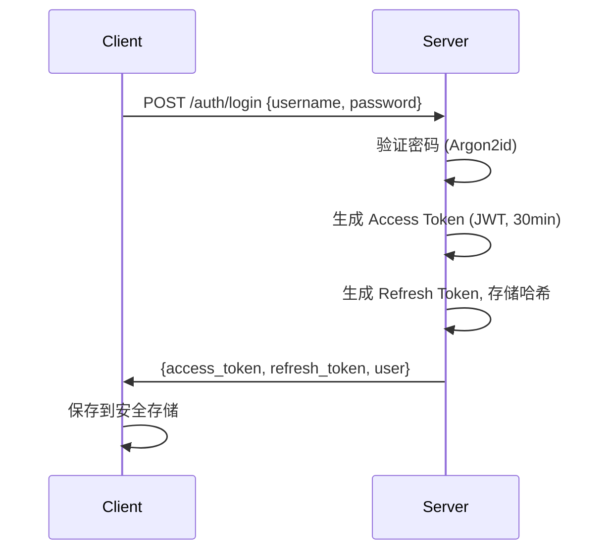
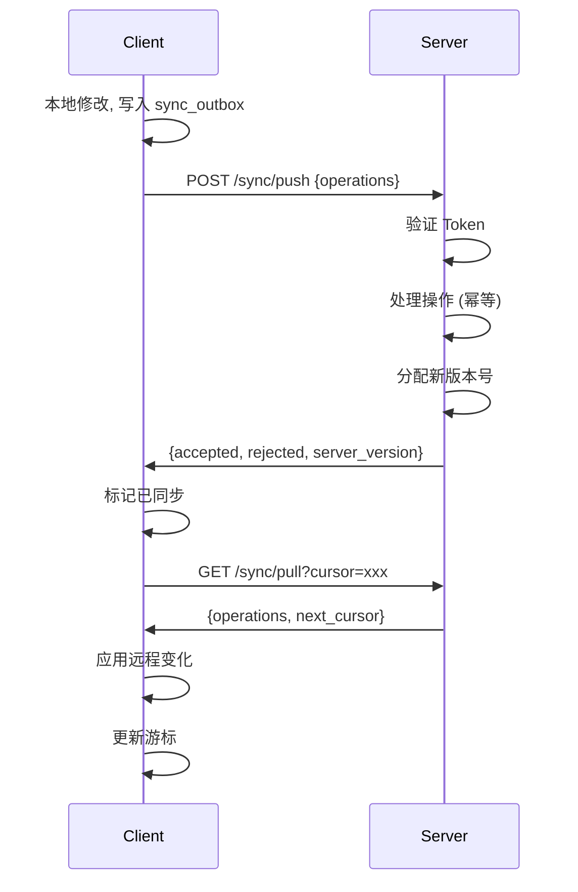
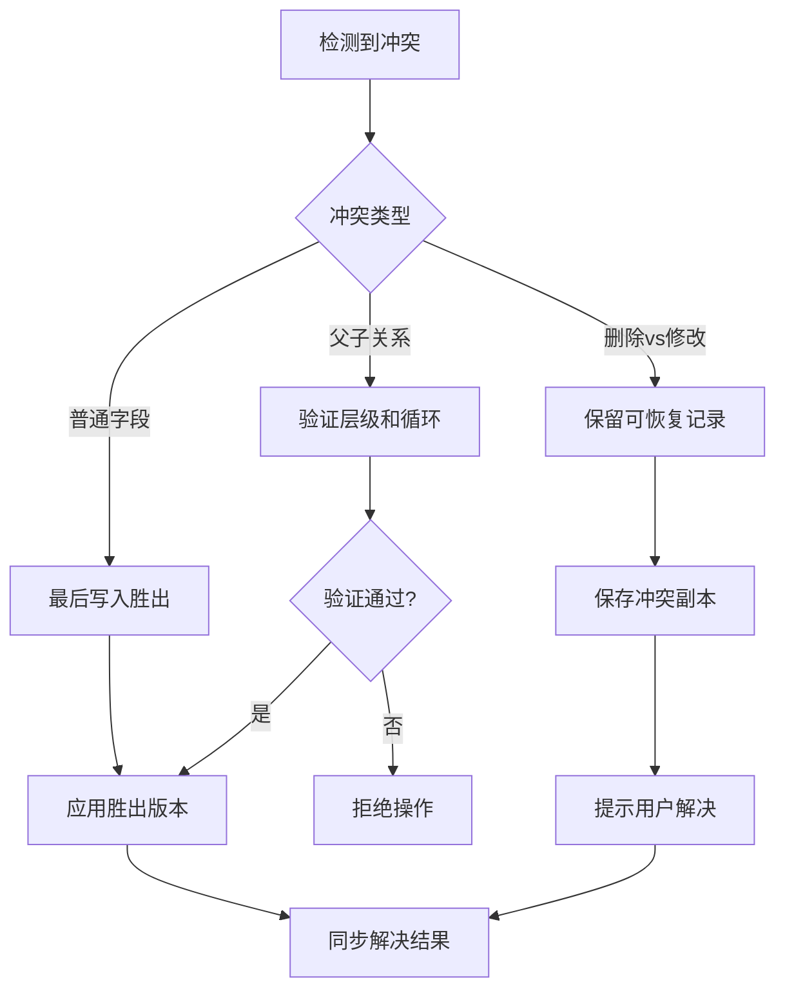

# M3 阶段计划任务：账号、设备和服务器 API

> 文档版本：v1.0
> 编制日期：2026-07-22
> 阶段目标：接入私有服务器，两台 PC 能可靠同步且不重复任务
> 前置依赖：M2 阶段完成

---

## 一、任务总览

| 任务组 | 任务数 | 优先级 | 预计产出 |
|---|---|---|---|
| 身份认证 | 8 | P0 | 认证系统 |
| 设备管理 | 5 | P0/P1 | 设备注册 |
| 基础 API | 11 | P0/P1 | REST API |
| 部署 | 8 | P0/P1 | Docker 部署 |
| 同步协议 | 9 | P0 | 同步引擎 |
| 同步状态机 | 8 | P0 | 状态管理 |
| 同步触发 | 8 | P0/P1 | 触发机制 |
| 冲突策略 | 7 | P0 | 冲突解决 |
| 同步测试 | 10 | P0 | 测试验证 |

**总计**：约 74 个任务项

---

## 二、身份认证

### 2.1 用户管理（P0）

- [ ] **AUTH-001** 创建管理员命令或初始化流程
  - CLI 命令：`python -m app.create_admin`
  - 或首次启动时引导创建
  - 只允许创建一个管理员

- [ ] **AUTH-002** 密码使用 Argon2id 哈希
  - 使用 `argon2-cffi` 库
  - 配置合适的参数（时间、内存、并行度）
  - 不存储明文密码

- [ ] **AUTH-003** 登录返回 Access Token 和 Refresh Token
  - Access Token：短期有效（30分钟）
  - Refresh Token：长期有效（7天）
  - 使用 JWT 格式

- [ ] **AUTH-004** Refresh Token 只保存哈希值
  - 服务端存储 Refresh Token 哈希
  - 支持撤销单个 Token
  - 支持撤销所有 Token

- [ ] **AUTH-005** 客户端 Token 保存到安全存储
  - 使用 Tauri 安全存储 API
  - 不写入明文配置文件
  - 不记录到日志

- [ ] **AUTH-006** 实现刷新、退出和 Token 撤销
  - `POST /api/v1/auth/refresh`：刷新 Token
  - `POST /api/v1/auth/logout`：退出登录
  - 撤销当前设备的 Token

- [ ] **AUTH-007** 登录接口增加速率限制
  - 同一 IP 每分钟最多 5 次尝试
  - 失败后锁定 15 分钟
  - 记录失败审计日志

- [ ] **AUTH-008** 禁止客户端直接携带大模型 API 密钥
  - AI 请求通过服务端代理
  - 服务端管理 API 密钥
  - 客户端不接触密钥

**产出物**：`services/api/api/v1/auth.py`

---

## 三、设备管理

### 3.1 设备注册（P0）

- [ ] **DEV-001** 首次登录注册设备信息
  - 设备 ID：UUID
  - 设备名称：用户自定义
  - 平台：Windows/macOS/Linux
  - 应用版本：x.x.x

- [ ] **DEV-002** 服务端记录设备最后同步时间
  - 每次同步更新时间戳
  - 用于显示设备状态

- [ ] **DEV-003** 客户端设置页列出当前设备信息
  - 设备名称
  - 设备 ID
  - 最后同步时间
  - 应用版本

### 3.2 设备管理（P1）

- [ ] **DEV-004** 支持查看全部登录设备
  - 设备列表页面
  - 显示设备信息和状态

- [ ] **DEV-005** 支持远程撤销指定设备
  - 撤销设备的 Token
  - 设备下次同步时提示重新登录

**产出物**：`services/api/api/v1/devices.py`

---

## 四、基础 API

### 4.1 认证 API（P0）

- [ ] **API-001** `POST /api/v1/auth/login`
  - 请求：用户名、密码
  - 响应：Access Token、Refresh Token、用户信息
  - 错误：用户名密码错误、账户锁定

- [ ] **API-002** `POST /api/v1/auth/refresh`
  - 请求：Refresh Token
  - 响应：新的 Access Token
  - 错误：Token 无效、已过期

- [ ] **API-003** `POST /api/v1/auth/logout`
  - 请求：无（使用当前 Token）
  - 响应：成功
  - 撤销当前 Token

- [ ] **API-004** `GET /api/v1/me`
  - 响应：用户信息、设备信息
  - 需要认证

### 4.2 设备 API（P0）

- [ ] **API-005** `POST /api/v1/devices/register`
  - 请求：设备名称、平台、版本
  - 响应：设备 ID
  - 首次登录自动调用

### 4.3 同步 API（P0）

- [ ] **API-006** `GET /api/v1/sync/pull?cursor=...`
  - 请求：游标、限制数量
  - 响应：操作列表、下一个游标
  - 增量拉取

- [ ] **API-007** `POST /api/v1/sync/push`
  - 请求：操作列表
  - 响应：接受的操作、拒绝的操作、新版本
  - 幂等操作

### 4.4 AI API（P0/P1）

- [ ] **API-008** `POST /api/v1/ai/parse-task`
  - 请求：用户原文、当前时间、时区
  - 响应：解析结果、置信度
  - P0 功能

- [ ] **API-009** `POST /api/v1/ai/transcribe`
  - 请求：音频文件
  - 响应：转写文本
  - P1 功能

### 4.5 通用要求（P0）

- [ ] **API-010** 所有写接口支持幂等请求 ID
  - 请求头：`X-Idempotency-Key`
  - 服务端记录已处理的 Key
  - 重复请求返回相同结果

- [ ] **API-011** 所有错误返回稳定的错误码
  - 格式：`{ "code": "XXX", "message": "..." }`
  - 错误码文档
  - 可读的错误说明

**产出物**：`services/api/api/v1/`

---

## 五、部署配置

### 5.1 容器部署（P0）

- [ ] **DEP-001** API、PostgreSQL 分容器部署
  - Docker Compose 配置
  - 网络隔离
  - 数据持久化

- [ ] **DEP-002** PostgreSQL 不直接暴露公网端口
  - 只允许内部网络访问
  - 通过 API 访问数据

- [ ] **DEP-003** Caddy 自动配置 HTTPS
  - 自动申请证书
  - 强制 HTTPS 重定向
  - HTTP/2 支持

- [ ] **DEP-004** 配置严格 CORS
  - 只允许必要来源
  - 只允许必要方法
  - 预检请求缓存

- [ ] **DEP-005** 配置容器健康检查
  - API 健康检查端点
  - PostgreSQL 健康检查
  - 自动重启策略

- [ ] **DEP-006** 配置数据库每日备份
  - 定时备份脚本
  - 保留最近 7 天备份
  - 备份文件加密

- [ ] **DEP-007** 实际执行一次全量恢复演练
  - 备份恢复流程
  - 数据完整性验证
  - 恢复时间记录

### 5.2 监控告警（P1）

- [ ] **DEP-008** 增加服务器监控告警
  - 磁盘空间监控
  - 数据库连接监控
  - 备份失败告警

**产出物**：`infra/docker/`, `infra/scripts/`

---

## 六、离线同步引擎

### 6.1 同步协议（P0）

- [ ] **SYNC-001** 每次本地写操作生成唯一 `operation_id`
  - 使用 UUIDv7
  - 客户端生成
  - 全局唯一

- [ ] **SYNC-002** 操作包含完整信息
  - 实体 ID
  - 操作类型（create/update/delete）
  - 本地基础版本
  - 修改内容（payload）

- [ ] **SYNC-003** 服务端幂等处理
  - 重复 `operation_id` 不重复执行
  - 返回相同结果
  - 记录已处理的操作

- [ ] **SYNC-004** 服务端分配递增游标
  - 全局版本号
  - 每次接受变化递增
  - 客户端通过游标增量拉取

- [ ] **SYNC-005** 客户端增量拉取
  - 不进行全库覆盖
  - 只拉取新变化
  - 支持分页

- [ ] **SYNC-006** 删除通过 tombstone 同步
  - 软删除记录
  - 同步删除标记
  - 物理删除前确认同步

- [ ] **SYNC-007** 服务端时间作为版本依据
  - 不信任客户端时间
  - 服务端排序
  - 防止时间篡改

- [ ] **SYNC-008** 批量同步限制
  - 单次最多 100 条操作
  - 载荷大小限制（1MB）
  - 超限时分批处理

- [ ] **SYNC-009** API 支持分页和断点续传
  - 游标分页
  - 记录同步进度
  - 恢复后继续

**产出物**：`services/api/services/sync.py`

---

### 6.2 客户端同步状态机（P0）

- [ ] **STATE-001** 未登录状态
  - 不执行同步
  - 本地操作正常
  - 提示登录

- [ ] **STATE-002** 空闲状态
  - 等待同步触发
  - 监听本地变化
  - 监听网络状态

- [ ] **STATE-003** 正在推送本地操作
  - 读取 sync_outbox
  - 批量推送到服务端
  - 标记已同步

- [ ] **STATE-004** 正在拉取远程变化
  - 使用游标拉取
  - 应用到本地
  - 更新游标

- [ ] **STATE-005** 正在应用变化
  - 解析远程操作
  - 应用到本地数据库
  - 处理冲突

- [ ] **STATE-006** 等待重试状态
  - 网络错误
  - 服务端错误
  - 指数退避重试

- [ ] **STATE-007** 需要重新登录
  - Token 过期
  - 尝试刷新 Token
  - 刷新失败提示登录

- [ ] **STATE-008** 发生冲突状态
  - 检测到冲突
  - 保存冲突副本
  - 提示用户解决

**产出物**：`apps/desktop/src/lib/sync.ts`

---

### 6.3 同步触发条件（P0/P1）

- [ ] **TRIG-001** 登录成功后同步
  - 首次同步
  - 拉取所有数据

- [ ] **TRIG-002** 应用启动后同步
  - 检查登录状态
  - 执行增量同步

- [ ] **TRIG-003** 本地数据变化后防抖同步
  - 监听数据库变化
  - 防抖 500ms
  - 批量推送

- [ ] **TRIG-004** 恢复网络连接后同步
  - 监听网络状态
  - 恢复后立即同步

- [ ] **TRIG-005** 从睡眠恢复后同步
  - 检测系统唤醒
  - 执行增量同步

- [ ] **TRIG-006** 固定间隔增量同步
  - 默认每 5 分钟
  - 可配置间隔
  - 只在空闲时执行

- [ ] **TRIG-007** 用户手动点击同步
  - 同步按钮
  - 显示同步状态
  - 显示同步结果

- [ ] **TRIG-008** WebSocket 通知（P1）
  - 服务端推送"有新变化"
  - 客户端触发拉取
  - 不传输实际数据

**产出物**：`apps/desktop/src/lib/sync.ts`

---

### 6.4 冲突策略（P0）

- [ ] **CONF-001** 定义字段级冲突规则
  - 普通字段：最后写入胜出
  - 关系字段：特殊处理
  - 删除字段：保留可恢复记录

- [ ] **CONF-002** 基于服务器版本的最后写入胜出
  - 比较 revision
  - 高版本胜出
  - 相同版本时间戳胜出

- [ ] **CONF-003** 删除与修改冲突处理
  - 保留可恢复记录
  - 不静默丢失内容
  - 标记为冲突

- [ ] **CONF-004** 父子关系冲突验证
  - 再次验证层级深度
  - 检测循环引用
  - 拒绝无效操作

- [ ] **CONF-005** 无法自动合并时保存副本
  - 保存本地版本
  - 保存远程版本
  - 标记为冲突

- [ ] **CONF-006** 界面显示冲突提示
  - 显示冲突详情
  - 允许选择版本
  - 支持手动合并

- [ ] **CONF-007** 冲突解决操作同步
  - 解决操作本身同步
  - 防止冲突复发
  - 记录解决历史

**产出物**：`apps/desktop/src/lib/conflict.ts`

---

## 七、执行顺序

```
阶段 1：服务端认证（第 1-2 周）
├── AUTH-001 ~ AUTH-008：用户认证
├── DEV-001 ~ DEV-003：设备管理
└── API-001 ~ API-005：认证和设备 API

阶段 2：同步 API（第 3-4 周）
├── API-006 ~ API-007：同步 API
├── SYNC-001 ~ SYNC-009：同步协议
└── 服务端同步逻辑

阶段 3：客户端同步（第 5-6 周）
├── STATE-001 ~ STATE-008：同步状态机
├── TRIG-001 ~ TRIG-008：同步触发
├── CONF-001 ~ CONF-007：冲突策略
└── 客户端同步逻辑

阶段 4：部署和测试（第 7-8 周）
├── DEP-001 ~ DEP-008：部署配置
├── 同步测试矩阵
└── 验收测试
```

---

## 八、技术设计

### 8.1 认证流程



### 8.2 同步流程



### 8.3 冲突解决



---

## 九、数据库设计

### 9.1 服务端表结构

```sql
-- 用户表
CREATE TABLE users (
    id UUID PRIMARY KEY,
    username VARCHAR(50) UNIQUE NOT NULL,
    password_hash VARCHAR(255) NOT NULL,
    created_at TIMESTAMP WITH TIME ZONE DEFAULT NOW(),
    updated_at TIMESTAMP WITH TIME ZONE DEFAULT NOW()
);

-- 设备表
CREATE TABLE devices (
    id UUID PRIMARY KEY,
    user_id UUID REFERENCES users(id),
    name VARCHAR(100) NOT NULL,
    platform VARCHAR(20) NOT NULL,
    app_version VARCHAR(20) NOT NULL,
    last_sync_at TIMESTAMP WITH TIME ZONE,
    created_at TIMESTAMP WITH TIME ZONE DEFAULT NOW()
);

-- Refresh Token 表
CREATE TABLE refresh_tokens (
    id UUID PRIMARY KEY,
    user_id UUID REFERENCES users(id),
    device_id UUID REFERENCES devices(id),
    token_hash VARCHAR(255) NOT NULL,
    expires_at TIMESTAMP WITH TIME ZONE NOT NULL,
    revoked_at TIMESTAMP WITH TIME ZONE,
    created_at TIMESTAMP WITH TIME ZONE DEFAULT NOW()
);

-- 同步操作表
CREATE TABLE sync_operations (
    id UUID PRIMARY KEY,
    user_id UUID REFERENCES users(id),
    operation_id UUID UNIQUE NOT NULL,
    entity_type VARCHAR(20) NOT NULL,
    entity_id UUID NOT NULL,
    operation VARCHAR(10) NOT NULL,
    payload JSONB NOT NULL,
    base_revision INTEGER,
    server_version BIGSERIAL,
    created_at TIMESTAMP WITH TIME ZONE DEFAULT NOW()
);

-- 同步游标表
CREATE TABLE sync_cursors (
    user_id UUID PRIMARY KEY REFERENCES users(id),
    last_cursor BIGINT NOT NULL DEFAULT 0,
    updated_at TIMESTAMP WITH TIME ZONE DEFAULT NOW()
);
```

---

## 十、完成标准

M3 阶段完成时，必须满足：

1. ✅ 用户可以注册和登录
2. ✅ Token 管理正常（刷新、撤销）
3. ✅ 设备注册和管理正常
4. ✅ 同步 API 正常工作
5. ✅ 两台设备可以同步数据
6. ✅ 离线创建的任务可以同步
7. ✅ 冲突可以正确处理
8. ✅ 部署配置完成
9. ✅ 所有测试通过

---

## 十一、测试矩阵

### 同步测试

| 测试 | 预期 |
|---|---|
| 两台设备同时离线创建任务 | 都能同步，不重复 |
| 两台设备同时修改同一标题 | 冲突正确处理 |
| 一台删除、一台修改同一任务 | 保留可恢复记录 |
| 一台完成父任务、一台完成部分子任务 | 正确合并 |
| 推送成功但客户端未收到响应 | 重试不重复 |
| 拉取一半时网络中断 | 恢复后继续 |
| 客户端时间快一天或慢一天 | 服务端时间为准 |
| 数据库含 10,000 条任务时首次同步 | 性能可接受 |
| 服务器返回重复事件 | 客户端幂等处理 |
| 客户端版本落后且不认识新字段 | 忽略未知字段 |

---

## 十二、风险与依赖

| 风险项 | 影响 | 应对措施 |
|---|---|---|
| 同步冲突复杂 | 数据丢失 | 完善冲突策略 |
| 网络不稳定 | 同步失败 | 重试和断点续传 |
| 大数据量同步 | 性能问题 | 分页和增量同步 |
| Token 安全 | 账户风险 | 安全存储和刷新 |

---

## 十三、相关文档

- [M0 阶段计划任务](./M0阶段计划任务.md)
- [M1 阶段计划任务](./M1阶段计划任务.md)
- [M2 阶段计划任务](./M2阶段计划任务.md)
- [共享协议](./packages/contracts/)

---

> 本文档定义了 M3 阶段的完整任务清单，建议严格按顺序执行
