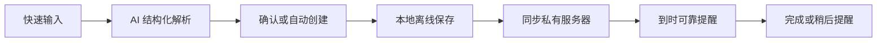
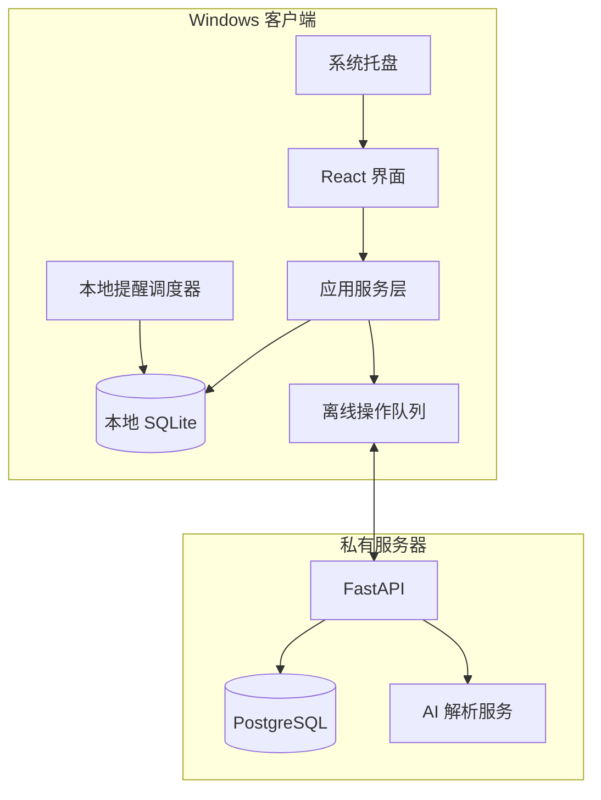

# PC 端 AI Todo 软件开发任务清单

> 文档版本：v1.0  
> 编制日期：2026-07-21  
> 首发平台：Windows 10/11（Windows 11 为主要测试平台）  
> 后续平台：Android  
> 产品方向：私有服务器同步 + 离线可用 + AI 自然语言建任务 + 可靠提醒

---

## 1. 项目目标

开发一款 Windows 桌面 Todo 软件。用户可以输入一段自然语言，软件通过后端大模型自动提取任务、子任务、日期、截止时间、提醒时间、优先级和重复规则，并将结果保存到本地和私有服务器。

首版必须形成下面的完整闭环：

### 1.1 首版核心价值

- 输入一句话即可建立结构化任务。
- 没有网络时仍能查看、创建、修改和完成任务。
- 恢复网络后自动与服务器同步。
- 即使主窗口关闭，程序仍可在系统托盘运行并提醒。
- 用户可以完整导出、备份和恢复自己的数据。

### 1.2 优先级定义

| 标记 | 含义 | 发布要求 |
|---|---|---|
| P0 | 首版核心 | 未完成不得发布 MVP |
| P1 | 首个正式版 | 可在 MVP 验证后补充 |
| P2 | 后续增强 | 不阻塞 PC 首版发布 |

### 1.3 首版不开发

- [ ] 多人团队协作、任务分配和评论。
- [ ] 甘特图和复杂项目管理。
- [ ] 习惯打卡、番茄钟和专注统计。
- [ ] AI 自动重排整天日程。
- [ ] Google Calendar、Outlook Calendar 双向同步。
- [ ] 浏览器扩展、邮箱转任务和聊天软件机器人。
- [ ] 插件市场和公开 API。
- [ ] iOS、macOS、Linux 客户端。

---

## 2. 推荐技术路线

### 2.1 默认技术栈

| 层级 | 推荐方案 | 用途 |
|---|---|---|
| Windows 客户端 | Tauri 2 | 桌面窗口、托盘、通知、全局快捷键、安装包和自动更新 |
| 前端 | React + TypeScript + Vite | 界面和交互 |
| 前端状态 | Zustand | 短期界面状态 |
| 数据查询 | 自建 Repository 层；需要时再引入 TanStack Query | 隔离 UI、本地库和远程 API |
| 本地数据库 | SQLite | 离线任务、同步队列、设置和缓存 |
| 服务端 | FastAPI + Pydantic | 登录、同步、AI 解析和设备管理 API |
| 服务端数据库 | PostgreSQL | 云端任务、用户、设备、版本和操作记录 |
| ORM/迁移 | SQLAlchemy 2 + Alembic | 服务端数据访问和数据库迁移 |
| 部署 | Docker Compose + Caddy | 容器部署、HTTPS 和反向代理 |
| 测试 | Vitest + React Testing Library + Pytest + Playwright/WebDriver | 单元、集成和端到端测试 |

选择 Tauri 2 的原因：它同时面向桌面与移动平台，使用系统 WebView，后期可继续探索 Android 复用；官方 SQL 插件支持 Windows、Android 和 SQLite，并提供数据库迁移机制。

### 2.2 必须保留的技术边界

- [ ] UI 不得直接拼接 SQL，统一通过 Repository/Service 层访问数据。
- [ ] AI 服务商封装成 Provider 接口，不能把应用写死在某一家模型上。
- [ ] 同步协议独立于 Tauri，未来 Android 客户端可以复用。
- [ ] 客户端数据库与服务端数据库分别维护迁移版本。
- [ ] 任务 ID 在客户端生成，离线创建时不依赖服务器。
- [ ] 时间、重复规则和任务结构定义放入共享协议包。

### 2.3 总体架构

---

## 3. 里程碑安排

| 里程碑 | 目标 | 完成出口 |
|---|---|---|
| M0：需求与原型 | 确定规则、界面和数据模型 | 原型、字段和关键规则冻结 |
| M1：本地 Todo | 完成本地离线任务管理 | 断网时可以独立使用全部基础功能 |
| M2：提醒与重复 | 完成本地提醒和重复任务 | 关闭主窗口后仍能按时提醒 |
| M3：账号与同步 | 接入私有服务器 | 两台 PC 能可靠同步且不重复任务 |
| M4：AI 快速创建 | 自然语言生成结构化任务 | 典型中文测试语料通过 |
| M5：数据安全 | 回收站、导入导出、备份 | 可以恢复误删和迁移全部数据 |
| M6：测试与发布 | 生成可安装版本 | 安装、升级、卸载和回滚验证通过 |

建议严格按 M0 → M1 → M2 → M3 → M4 → M5 → M6 开发，不要先做完整 AI 界面再补同步底层。

---

## 4. M0：需求、规则和原型

### 4.1 产品规则确认

- [ ] `[P0]` 确认首版只支持单用户，服务端暂不开放注册。
- [ ] `[P0]` 确认登录方式：服务器地址 + 用户名 + 密码。
- [ ] `[P0]` 确认任务层级最多 3 级。
- [ ] `[P0]` 确认默认时区跟随 Windows 系统。
- [ ] `[P0]` 确认日期、截止时间和提醒时间是不同字段。
- [ ] `[P0]` 确认无时间任务默认不推送，除非用户设置默认提醒规则。
- [ ] `[P0]` 确认回收站按时间保留 30 天，不再按“最近 10 条”限制。
- [ ] `[P0]` 确认父子任务完成规则。
- [ ] `[P0]` 确认 AI 高置信度结果自动建立，低置信度结果要求确认。
- [ ] `[P0]` 确认 AI 自动创建后提供明显的撤销入口。
- [ ] `[P1]` 确认是否保存 AI 原始输入和解析结果。
- [ ] `[P1]` 确认语音原始音频是否立即删除。

### 4.2 父子任务规则

- [ ] `[P0]` 子任务全部完成时，自动完成父任务。
- [ ] `[P0]` 父任务仍有未完成子任务时，完成父任务必须弹出确认。
- [ ] `[P0]` 确认框提供“仅完成父任务”和“同时完成所有子任务”。
- [ ] `[P0]` 重新打开父任务时，允许选择是否恢复子任务。
- [ ] `[P0]` 禁止把任务移动到自己的子孙任务下面，防止形成循环。
- [ ] `[P0]` 父任务删除时，其子任务一起进入回收站。
- [ ] `[P1]` 子任务截止时间晚于父任务时给出警告，但不强制阻止。

### 4.3 页面与交互原型

- [ ] `[P0]` 绘制登录与服务器配置页。
- [ ] `[P0]` 绘制主界面：左侧导航、任务列表、右侧详情面板。
- [ ] `[P0]` 绘制 Inbox、今天、未来 7 天、已逾期、已完成、回收站页面。
- [ ] `[P0]` 绘制顶部快速添加栏。
- [ ] `[P0]` 绘制 AI 解析确认卡片。
- [ ] `[P0]` 绘制任务详情编辑面板。
- [ ] `[P0]` 绘制重复规则编辑器。
- [ ] `[P0]` 绘制多提醒编辑器。
- [ ] `[P0]` 绘制同步状态和冲突提示。
- [ ] `[P0]` 绘制导入预览与错误报告页面。
- [ ] `[P1]` 绘制全局快捷添加小窗口。
- [ ] `[P1]` 绘制语音录入与转写确认页面。

### 4.4 MVP 验收场景

- [ ] 输入“明天下午三点交实验报告，提前一天和一小时提醒”，能建立正确任务。
- [ ] 输入“每周一晚上八点复习高数”，能建立重复任务。
- [ ] 输入“月底完成实习报告，分为整理照片、写正文、调整格式”，能建立父子任务。
- [ ] 断网创建任务，重启软件后任务仍存在。
- [ ] 恢复网络后，离线任务自动上传服务器。
- [ ] 主窗口关闭到托盘后，提醒仍能正常弹出。
- [ ] 删除一个包含子任务的项目后，可以从回收站完整恢复。

---

## 5. M0：工程基础

### 5.1 仓库结构

- [ ] `[P0]` 建立 Git 仓库和主分支保护规则。
- [ ] `[P0]` 建立目录：`apps/desktop`。
- [ ] `[P0]` 建立目录：`services/api`。
- [ ] `[P0]` 建立目录：`packages/contracts`。
- [ ] `[P0]` 建立目录：`infra/docker`。
- [ ] `[P0]` 建立目录：`docs`。
- [ ] `[P0]` 建立 `.env.example`，不得提交真实密钥。
- [ ] `[P0]` 添加统一的版本号策略。
- [ ] `[P0]` 添加开发、测试、生产三套配置。

### 5.2 客户端工程

- [ ] `[P0]` 初始化 Tauri 2 + React + TypeScript + Vite。
- [ ] `[P0]` 配置 ESLint、Prettier 和严格 TypeScript。
- [ ] `[P0]` 配置路径别名和模块边界。
- [ ] `[P0]` 配置单元测试和组件测试。
- [ ] `[P0]` 配置开发环境错误边界。
- [ ] `[P0]` 配置结构化日志和日志轮换。
- [ ] `[P0]` 禁止日志记录密码、Token、任务正文和完整 AI 输入。
- [ ] `[P1]` 配置端到端测试环境。

### 5.3 服务端工程

- [ ] `[P0]` 初始化 FastAPI 项目。
- [ ] `[P0]` 按 `api/domain/services/repositories/models` 分层。
- [ ] `[P0]` 启用 Pydantic 严格校验。
- [ ] `[P0]` 生成 OpenAPI 文档。
- [ ] `[P0]` 配置 SQLAlchemy 2 和 Alembic。
- [ ] `[P0]` 配置 PostgreSQL 测试数据库。
- [ ] `[P0]` 增加 `/health`、`/ready` 和 `/version` 接口。
- [ ] `[P0]` 编写 Dockerfile 和 Docker Compose。
- [ ] `[P0]` 配置 Caddy HTTPS 反向代理。
- [ ] `[P0]` 配置数据库定时备份和恢复脚本。

### 5.4 共享协议

- [ ] `[P0]` 定义任务、提醒、重复规则、同步操作的 JSON Schema。
- [ ] `[P0]` 客户端和服务端从同一份 Schema 生成或校验类型。
- [ ] `[P0]` 给 API 增加显式版本，例如 `/api/v1`。
- [ ] `[P0]` 规定所有 ID 使用 UUIDv7 或等价的客户端可生成 UUID。
- [ ] `[P0]` 规定时间戳使用 ISO 8601，并在传输时使用 UTC。
- [ ] `[P0]` 全天任务使用独立日期字段，禁止用 UTC 零点模拟。

---

## 6. M1：本地数据库与数据模型

### 6.1 本地数据库初始化

- [ ] `[P0]` 接入 Tauri SQL 插件和 SQLite。
- [ ] `[P0]` 建立版本化迁移机制。
- [ ] `[P0]` 启用 `PRAGMA foreign_keys = ON`。
- [ ] `[P0]` 评估并启用 WAL 模式。
- [ ] `[P0]` 确认所带 SQLite 版本已修复 2026 年披露的 WAL-reset 问题。
- [ ] `[P0]` 设置合理的 `busy_timeout`。
- [ ] `[P0]` 所有批量修改使用事务。
- [ ] `[P0]` 应用启动时自动执行迁移，失败时停止写入并提示备份。
- [ ] `[P0]` 数据库升级前自动复制一份本地备份。

### 6.2 核心数据表

- [ ] `[P0]` `tasks`：任务主体。
- [ ] `[P0]` `projects`：项目或清单。
- [ ] `[P0]` `tags`：标签。
- [ ] `[P0]` `task_tags`：任务与标签关系。
- [ ] `[P0]` `reminders`：一个任务的多个提醒。
- [ ] `[P0]` `recurrence_rules`：重复规则。
- [ ] `[P0]` `task_events`：创建、修改、完成、删除等历史。
- [ ] `[P0]` `sync_outbox`：待上传离线操作。
- [ ] `[P0]` `sync_state`：设备同步游标和服务器版本。
- [ ] `[P0]` `settings`：用户设置。
- [ ] `[P0]` `ai_captures`：原始输入、解析状态和置信度。
- [ ] `[P1]` `import_jobs`：导入任务和回滚信息。

### 6.3 `tasks` 字段

- [ ] `[P0]` `id`。
- [ ] `[P0]` `parent_id`。
- [ ] `[P0]` `project_id`。
- [ ] `[P0]` `title`。
- [ ] `[P0]` `note`。
- [ ] `[P0]` `status`：待办、完成、取消。
- [ ] `[P0]` `priority`：P1～P4 或无优先级。
- [ ] `[P0]` `sort_order`。
- [ ] `[P0]` `scheduled_date`。
- [ ] `[P0]` `scheduled_at`。
- [ ] `[P0]` `due_at`。
- [ ] `[P0]` `is_all_day`。
- [ ] `[P0]` `timezone`。
- [ ] `[P1]` `estimated_minutes`。
- [ ] `[P0]` `created_at`、`updated_at`、`completed_at`。
- [ ] `[P0]` `deleted_at`：软删除标记。
- [ ] `[P0]` `revision`：同步版本。
- [ ] `[P0]` `source`：手动、AI、导入、API。
- [ ] `[P0]` `source_capture_id`：对应 AI 原始输入。

### 6.4 数据完整性

- [ ] `[P0]` 标题去除首尾空白，空标题不得保存。
- [ ] `[P0]` 设置标题、备注和附件大小上限。
- [ ] `[P0]` 外键和唯一索引设计完成。
- [ ] `[P0]` 为常用查询建立索引：状态、日期、项目、更新时间、删除时间。
- [ ] `[P0]` 禁止父子任务形成环。
- [ ] `[P0]` 软删除记录保留同步墓碑，未同步前不得物理删除。
- [ ] `[P0]` 物理清理回收站前确认所有活动设备已收到删除事件。

---

## 7. M1：Windows 客户端外壳

### 7.1 主窗口

- [ ] `[P0]` 保存并恢复窗口大小、位置和最大化状态。
- [ ] `[P0]` 双屏环境下验证窗口不会恢复到不可见区域。
- [ ] `[P0]` 支持浅色、深色和跟随系统主题。
- [ ] `[P0]` 支持 100%、125%、150%、200% DPI 缩放。
- [ ] `[P0]` 防止启动多个应用实例。
- [ ] `[P0]` 第二次启动时唤醒已有窗口。
- [ ] `[P1]` 支持最小化启动。

### 7.2 系统托盘

- [ ] `[P0]` 创建托盘图标。
- [ ] `[P0]` 单击托盘图标显示或隐藏主窗口。
- [ ] `[P0]` 托盘菜单包含“快速添加、今天、同步、设置、退出”。
- [ ] `[P0]` 点击窗口关闭按钮时默认隐藏到托盘，不直接结束进程。
- [ ] `[P0]` 真正退出前提示“退出后将无法收到本地提醒”。
- [ ] `[P1]` 支持开机自启动开关。

### 7.3 快捷键

- [ ] `[P0]` `Ctrl+N`：新建普通任务。
- [ ] `[P0]` `Ctrl+K`：全局搜索。
- [ ] `[P0]` `Ctrl+Enter`：保存任务。
- [ ] `[P0]` `Esc`：关闭详情或弹窗。
- [ ] `[P1]` 注册全局快捷键，例如 `Ctrl+Shift+A`。
- [ ] `[P1]` 全局快捷键打开轻量快速添加窗口。
- [ ] `[P1]` 快捷键冲突时允许用户重新设置。

### 7.4 自动更新

- [ ] `[P1]` 接入签名更新清单。
- [ ] `[P1]` 启动后静默检查更新。
- [ ] `[P1]` 支持下载进度、失败重试和稍后安装。
- [ ] `[P1]` 数据库迁移失败时阻止新版本继续运行。
- [ ] `[P1]` 保留上一安装包或提供明确回滚方式。

---

## 8. M1：本地任务功能

### 8.1 基础 CRUD

- [ ] `[P0]` 新建任务。
- [ ] `[P0]` 编辑标题和备注。
- [ ] `[P0]` 标记完成和取消完成。
- [ ] `[P0]` 软删除任务。
- [ ] `[P0]` 复制任务。
- [ ] `[P0]` 移动到其他项目。
- [ ] `[P0]` 设置优先级。
- [ ] `[P0]` 添加和删除标签。
- [ ] `[P0]` 拖动调整同级任务顺序。
- [ ] `[P0]` 所有修改立即写入本地数据库，不依赖服务器响应。
- [ ] `[P0]` 每次修改同时写入同步队列。

### 8.2 内置视图

- [ ] `[P0]` Inbox。
- [ ] `[P0]` 今天。
- [ ] `[P0]` 未来 7 天。
- [ ] `[P0]` 已逾期。
- [ ] `[P0]` 无日期任务。
- [ ] `[P0]` 已完成。
- [ ] `[P0]` 回收站。
- [ ] `[P1]` 收藏视图。
- [ ] `[P1]` 保存的自定义筛选器。

### 8.3 搜索、筛选与排序

- [ ] `[P0]` 搜索标题和备注。
- [ ] `[P0]` 按项目、标签、优先级、状态筛选。
- [ ] `[P0]` 按计划时间、截止时间、创建时间和手动顺序排序。
- [ ] `[P0]` 支持“仅显示父任务”或“展开全部子任务”。
- [ ] `[P0]` 清楚显示当前生效的筛选条件。
- [ ] `[P0]` 为 10,000 条任务建立性能测试。
- [ ] `[P1]` 支持组合筛选并保存为智能列表。

### 8.4 批量操作

- [ ] `[P0]` 多选任务。
- [ ] `[P0]` 批量完成、恢复、删除。
- [ ] `[P0]` 批量移动项目。
- [ ] `[P0]` 批量添加或移除标签。
- [ ] `[P0]` 批量修改优先级。
- [ ] `[P1]` 批量修改日期和提醒。
- [ ] `[P0]` 批量操作必须可以立即撤销。

### 8.5 父子任务实现

- [ ] `[P0]` 新建子任务。
- [ ] `[P0]` 将普通任务缩进或提升层级。
- [ ] `[P0]` 折叠和展开子任务。
- [ ] `[P0]` 显示父任务完成进度，例如 `3/5`。
- [ ] `[P0]` 在单个数据库事务内执行父子完成联动。
- [ ] `[P0]` 父任务联动产生的每个变化都进入同步队列。
- [ ] `[P0]` 验证循环引用、越级移动和并发完成。

---

## 9. M2：时间、重复任务和提醒

### 9.1 时间规则

- [ ] `[P0]` 区分计划日期、计划时间、截止时间和提醒时间。
- [ ] `[P0]` 所有精确时间保存 UTC，同时保留原始时区。
- [ ] `[P0]` 全天任务按本地日期存储。
- [ ] `[P0]` 系统时区改变后重新计算未来提醒。
- [ ] `[P0]` 系统时间被手动修改后重新扫描提醒。
- [ ] `[P0]` 夏令时切换测试通过。
- [ ] `[P0]` 允许一个任务设置多个提醒。

### 9.2 重复规则

- [ ] `[P0]` 每天。
- [ ] `[P0]` 每个工作日。
- [ ] `[P0]` 每周指定星期。
- [ ] `[P0]` 每月指定日期。
- [ ] `[P0]` 每年指定日期。
- [ ] `[P0]` 完成后每隔 N 天。
- [ ] `[P0]` 设置重复开始日期和结束日期。
- [ ] `[P0]` 完成本次后生成下一次实例。
- [ ] `[P0]` 支持跳过本次。
- [ ] `[P1]` 每月第 N 个星期几。
- [ ] `[P1]` 每月最后一天。
- [ ] `[P1]` 只修改本次、此次及以后或整个系列。
- [ ] `[P0]` 重复父任务可以重置指定子任务。
- [ ] `[P0]` 为月末、闰年和夏令时建立边界测试。

### 9.3 本地提醒调度器

- [ ] `[P0]` 建立独立的提醒调度服务。
- [ ] `[P0]` 应用启动时加载未来提醒。
- [ ] `[P0]` 任务修改后取消旧提醒并重新调度。
- [ ] `[P0]` 应用从睡眠恢复时扫描错过的提醒。
- [ ] `[P0]` 恢复网络不应重复弹出已经处理的提醒。
- [ ] `[P0]` 主窗口关闭到托盘后提醒继续运行。
- [ ] `[P0]` 通知点击后打开对应任务。
- [ ] `[P0]` 支持“完成”和“稍后提醒”。
- [ ] `[P0]` 稍后提醒支持 10 分钟、1 小时、明天。
- [ ] `[P0]` 记录提醒已触发、已确认、已稍后和已取消状态。
- [ ] `[P0]` 安静时段内将普通提醒延后到安静时段结束。
- [ ] `[P1]` 重要任务允许绕过应用内安静时段。
- [ ] `[P1]` 研究 Windows 原生计划通知，降低对托盘常驻的依赖。

### 9.4 提醒验收

- [ ] 锁屏时能显示通知。
- [ ] 主窗口关闭但托盘运行时能显示通知。
- [ ] 电脑睡眠越过提醒时间后，唤醒时出现错过提醒。
- [ ] 修改任务时间后旧通知不会再出现。
- [ ] 删除任务后其通知不会再出现。
- [ ] 同一提醒在单台设备只显示一次。
- [ ] 重复任务完成后下一实例提醒正确。

---

## 10. M3：账号、设备和服务器 API

### 10.1 身份认证

- [ ] `[P0]` 创建管理员命令或初始化流程，用于建立首个用户。
- [ ] `[P0]` 密码使用 Argon2id 等适合密码的算法哈希。
- [ ] `[P0]` 登录成功返回短期 Access Token 和可轮换 Refresh Token。
- [ ] `[P0]` Refresh Token 只保存哈希值或可撤销标识。
- [ ] `[P0]` 客户端 Token 保存到安全凭据存储，不写入明文配置。
- [ ] `[P0]` 实现刷新、退出和 Token 撤销。
- [ ] `[P0]` 登录接口增加速率限制和失败审计。
- [ ] `[P0]` 禁止客户端直接携带大模型 API 密钥。

### 10.2 设备管理

- [ ] `[P0]` 首次登录注册设备 ID、名称、平台和应用版本。
- [ ] `[P0]` 服务端记录设备最后同步时间。
- [ ] `[P0]` 客户端设置页列出当前设备信息。
- [ ] `[P1]` 支持查看全部登录设备。
- [ ] `[P1]` 支持远程撤销指定设备。

### 10.3 基础 API

- [ ] `[P0]` `POST /api/v1/auth/login`。
- [ ] `[P0]` `POST /api/v1/auth/refresh`。
- [ ] `[P0]` `POST /api/v1/auth/logout`。
- [ ] `[P0]` `GET /api/v1/me`。
- [ ] `[P0]` `POST /api/v1/devices/register`。
- [ ] `[P0]` `GET /api/v1/sync/pull?cursor=...`。
- [ ] `[P0]` `POST /api/v1/sync/push`。
- [ ] `[P0]` `POST /api/v1/ai/parse-task`。
- [ ] `[P1]` `POST /api/v1/ai/transcribe`。
- [ ] `[P0]` 所有写接口支持幂等请求 ID。
- [ ] `[P0]` 所有错误返回稳定的错误码和可读说明。

### 10.4 部署

- [ ] `[P0]` API、PostgreSQL 分容器部署。
- [ ] `[P0]` PostgreSQL 不直接暴露公网端口。
- [ ] `[P0]` Caddy 自动配置 HTTPS。
- [ ] `[P0]` 只允许必要来源和方法，配置严格 CORS。
- [ ] `[P0]` 配置容器健康检查和自动重启。
- [ ] `[P0]` 配置数据库每日备份和保留周期。
- [ ] `[P0]` 实际执行一次全量恢复演练。
- [ ] `[P1]` 增加服务器磁盘、数据库和备份失败告警。

---

## 11. M3：离线同步引擎

### 11.1 同步协议

- [ ] `[P0]` 每次本地写操作生成唯一 `operation_id`。
- [ ] `[P0]` 操作包含实体 ID、操作类型、本地基础版本和修改内容。
- [ ] `[P0]` 服务端重复收到同一 `operation_id` 时不得重复执行。
- [ ] `[P0]` 服务端为每次接受的变化分配递增游标或全局版本。
- [ ] `[P0]` 客户端通过游标增量拉取，不进行全库覆盖。
- [ ] `[P0]` 删除通过 tombstone 同步。
- [ ] `[P0]` 服务端时间作为版本排序依据，不信任客户端系统时间。
- [ ] `[P0]` 批量同步设置单次数量和载荷大小限制。
- [ ] `[P0]` API 支持分页和断点续传。

### 11.2 客户端同步状态机

- [ ] `[P0]` 未登录。
- [ ] `[P0]` 空闲。
- [ ] `[P0]` 正在推送本地操作。
- [ ] `[P0]` 正在拉取远程变化。
- [ ] `[P0]` 正在应用变化。
- [ ] `[P0]` 等待重试。
- [ ] `[P0]` 需要重新登录。
- [ ] `[P0]` 发生不可自动解决冲突。

### 11.3 同步触发条件

- [ ] `[P0]` 登录成功后。
- [ ] `[P0]` 应用启动后。
- [ ] `[P0]` 本地数据发生变化后进行防抖同步。
- [ ] `[P0]` 恢复网络连接后。
- [ ] `[P0]` 从睡眠恢复后。
- [ ] `[P0]` 固定间隔增量同步。
- [ ] `[P0]` 用户手动点击同步。
- [ ] `[P1]` WebSocket 只用于通知“有新变化”，真实数据仍通过同步 API 拉取。

### 11.4 冲突策略

- [ ] `[P0]` 定义字段级或实体级冲突规则。
- [ ] `[P0]` 对普通字段采用基于服务器版本的最后写入胜出。
- [ ] `[P0]` 删除与修改冲突时保留可恢复记录，不静默丢失内容。
- [ ] `[P0]` 父子关系冲突时再次验证层级深度和循环。
- [ ] `[P0]` 无法自动合并时保存冲突副本。
- [ ] `[P0]` 界面显示冲突提示并允许选择版本。
- [ ] `[P0]` 冲突解决操作本身也必须同步。

### 11.5 同步测试矩阵

- [ ] 两台设备同时离线创建任务。
- [ ] 两台设备同时修改同一标题。
- [ ] 一台删除、一台修改同一任务。
- [ ] 一台完成父任务、一台完成部分子任务。
- [ ] 推送成功但客户端未收到响应，随后重试。
- [ ] 拉取一半时网络中断，恢复后继续。
- [ ] 客户端时间快一天或慢一天。
- [ ] 数据库含 10,000 条任务时首次同步。
- [ ] 服务器返回重复事件。
- [ ] 客户端版本落后且不认识新字段。

---

## 12. M4：AI 自然语言建任务

### 12.1 AI Provider 层

- [ ] `[P0]` 定义统一 `TaskParserProvider` 接口。
- [ ] `[P0]` 支持配置模型名称、API Base、API Key 和超时。
- [ ] `[P0]` 密钥只保存在服务端环境变量或 Secret 文件中。
- [ ] `[P0]` 为模型请求配置超时、重试和并发限制。
- [ ] `[P0]` 模型不可用时允许退回普通任务创建。
- [ ] `[P1]` 支持主模型和备用模型。
- [ ] `[P1]` 记录调用耗时、Token 和错误码，不记录敏感正文。

### 12.2 解析流程

- [ ] `[P0]` 接收用户原文、当前时间、时区和用户默认设置。
- [ ] `[P0]` 先用确定性规则识别明确日期、时间和重复关键词。
- [ ] `[P0]` 将剩余语义交给大模型拆解。
- [ ] `[P0]` 强制模型按 JSON Schema 输出。
- [ ] `[P0]` 服务端再次校验标题、日期、层级、提醒和数量限制。
- [ ] `[P0]` 解析相对日期时以服务端传入的“当前时间”作为唯一基准。
- [ ] `[P0]` 返回解析置信度和警告列表。
- [ ] `[P0]` 原文被视为数据，防止其中的指令修改系统提示词。
- [ ] `[P0]` 单次最多生成约定数量的任务，例如 20 条。
- [ ] `[P0]` 超过层级上限时自动拍平并提示。

### 12.3 AI 输出字段

- [ ] `[P0]` 任务标题。
- [ ] `[P0]` 详细备注。
- [ ] `[P0]` 计划日期和时间。
- [ ] `[P0]` 截止时间。
- [ ] `[P0]` 多个提醒时间。
- [ ] `[P0]` 优先级。
- [ ] `[P0]` 项目建议。
- [ ] `[P0]` 标签建议。
- [ ] `[P0]` 子任务列表。
- [ ] `[P0]` 重复规则。
- [ ] `[P1]` 预计耗时。
- [ ] `[P0]` 不确定字段和解释。

### 12.4 用户交互

- [ ] `[P0]` 快速添加框区分“普通创建”和“AI 创建”。
- [ ] `[P0]` 请求过程中显示加载状态并允许取消。
- [ ] `[P0]` 高置信度结果可直接进入 Inbox。
- [ ] `[P0]` 自动创建后显示任务摘要和撤销按钮。
- [ ] `[P0]` 低置信度结果显示确认卡片。
- [ ] `[P0]` 用户可以在卡片中修改任何字段再保存。
- [ ] `[P0]` AI 失败时保留原始文字，不让输入丢失。
- [ ] `[P0]` 防止用户重复点击导致创建多份任务。

### 12.5 中文测试语料

- [ ] `[P0]` “明天下午三点交报告”。
- [ ] `[P0]` “下周五前交报告，提前一天提醒”。
- [ ] `[P0]` “今晚有空整理桌面”。
- [ ] `[P0]` “每周一三五晚上八点跑步”。
- [ ] `[P0]` “每个月最后一天备份服务器”。
- [ ] `[P0]` “做实验报告，分成收集数据、画图、写分析”。
- [ ] `[P0]` “下午提醒我一下”。
- [ ] `[P0]` “过两天提醒我续费”。
- [ ] `[P0]` “月底之前完成”。
- [ ] `[P0]` 同一段文字包含三个独立任务。
- [ ] `[P0]` 包含否定表达，例如“不要提醒我”。
- [ ] `[P0]` 包含过去日期、日期冲突和无效时间。
- [ ] `[P0]` 包含试图操纵模型的提示注入文本。

### 12.6 AI 验收标准

- [ ] 明确日期和时间测试集准确率达到约定阈值，例如 95%。
- [ ] 明确重复规则测试集准确率达到约定阈值，例如 90%。
- [ ] 所有模型返回都必须通过 JSON Schema 校验。
- [ ] 不合法日期不得直接创建带提醒的任务。
- [ ] AI 超时不会阻塞普通任务功能。
- [ ] 相同请求重试不会重复创建任务。

---

## 13. M5：PC 语音输入（P1）

- [ ] `[P1]` 增加按住说话或点击录音按钮。
- [ ] `[P1]` 首次录音时请求麦克风权限。
- [ ] `[P1]` 显示录音时长和音量状态。
- [ ] `[P1]` 设置单段录音时长和文件大小限制。
- [ ] `[P1]` 将音频上传到后端语音转文字接口。
- [ ] `[P1]` 转写结果先显示为可编辑文字。
- [ ] `[P1]` 将确认后的文字送入 AI 任务解析流程。
- [ ] `[P1]` 支持一句话拆分多个任务。
- [ ] `[P1]` 默认在转写完成后删除服务端临时音频。
- [ ] `[P1]` 网络失败时保留本地草稿并允许重试。
- [ ] `[P1]` 建立普通话、数字、日期和中英混合测试集。

---

## 14. M5：回收站、导入导出和备份

### 14.1 回收站

- [ ] `[P0]` 所有删除默认进入回收站。
- [ ] `[P0]` 删除后显示即时撤销。
- [ ] `[P0]` 回收站显示原项目、删除时间和剩余保留天数。
- [ ] `[P0]` 支持单个和批量恢复。
- [ ] `[P0]` 恢复父任务时一并恢复其子任务。
- [ ] `[P0]` 支持手动永久删除并二次确认。
- [ ] `[P0]` 30 天后后台物理清理。
- [ ] `[P0]` 清理前确保删除墓碑已同步到服务器。

### 14.2 导入

- [ ] `[P0]` 支持标准 CSV。
- [ ] `[P0]` 支持本软件完整 JSON 备份。
- [ ] `[P1]` 支持 Markdown 复选框。
- [ ] `[P1]` 支持常见 Todo 软件导出格式。
- [ ] `[P0]` 自动识别 UTF-8、UTF-8 BOM，并明确报告不支持的编码。
- [ ] `[P0]` 提供列名和字段映射。
- [ ] `[P0]` 导入前预览前若干条数据。
- [ ] `[P0]` 检测重复 ID 和疑似重复任务。
- [ ] `[P0]` 无效日期、层级或提醒进入错误报告。
- [ ] `[P0]` 导入使用事务或独立批次 ID。
- [ ] `[P0]` 支持整批撤销。
- [ ] `[P0]` 大文件导入显示进度并允许取消。

### 14.3 导出与备份

- [ ] `[P0]` 导出完整 JSON，包括任务、子任务、标签、提醒和重复规则。
- [ ] `[P0]` 导出通用 CSV。
- [ ] `[P1]` 导出 Markdown。
- [ ] `[P0]` 导出文件包含格式版本和创建时间。
- [ ] `[P0]` 提供手动本地备份。
- [ ] `[P0]` 提供一键恢复并显示影响范围。
- [ ] `[P0]` 恢复前自动备份当前数据库。
- [ ] `[P0]` 备份和恢复均校验文件完整性。
- [ ] `[P1]` 支持定时自动备份和保留数量设置。

---

## 15. 安全与隐私清单

### 15.1 客户端

- [ ] `[P0]` Token 不写入普通设置文件或日志。
- [ ] `[P0]` Tauri 权限按最小权限配置。
- [ ] `[P0]` 配置严格 CSP，禁止加载未知远程脚本。
- [ ] `[P0]` 限制文件系统访问范围。
- [ ] `[P0]` 外部链接通过系统浏览器打开。
- [ ] `[P0]` 防止任务正文作为 HTML 直接渲染。
- [ ] `[P0]` 日志默认不包含任务标题、备注和 AI 原文。
- [ ] `[P0]` 提供清除本地数据和退出登录功能。

### 15.2 服务端

- [ ] `[P0]` 所有外部访问强制 HTTPS。
- [ ] `[P0]` 数据库、模型 API Key 和 JWT Secret 不写进镜像。
- [ ] `[P0]` 登录、AI 和导入接口配置请求大小限制。
- [ ] `[P0]` 对用户输入、模型输出和文件名进行校验。
- [ ] `[P0]` 依赖锁定版本并定期扫描漏洞。
- [ ] `[P0]` 数据库按最小权限账号运行。
- [ ] `[P0]` 备份文件限制访问权限。
- [ ] `[P0]` 管理接口不得暴露公网或必须单独鉴权。

### 15.3 AI 隐私

- [ ] `[P0]` 设置页显示当前 AI 服务商和服务器地址。
- [ ] `[P0]` 明确提示哪些文字会被发送给第三方模型。
- [ ] `[P0]` 只发送完成本次解析所需内容，不发送整个任务库。
- [ ] `[P0]` 允许关闭 AI，关闭后普通 Todo 仍完整可用。
- [ ] `[P1]` 提供敏感内容脱敏选项。
- [ ] `[P1]` 提供自定义 API Base 和用户自备密钥能力。

---

## 16. 测试任务清单

### 16.1 单元测试

- [ ] `[P0]` 任务 CRUD。
- [ ] `[P0]` 父子完成联动。
- [ ] `[P0]` 循环层级检测。
- [ ] `[P0]` 日期和时区转换。
- [ ] `[P0]` 重复任务下一实例计算。
- [ ] `[P0]` 提醒去重和稍后提醒。
- [ ] `[P0]` 回收站保留期限。
- [ ] `[P0]` 同步操作幂等性。
- [ ] `[P0]` 冲突合并规则。
- [ ] `[P0]` AI JSON Schema 校验。
- [ ] `[P0]` CSV/JSON 导入校验。

### 16.2 集成测试

- [ ] `[P0]` 客户端 SQLite 迁移。
- [ ] `[P0]` FastAPI + PostgreSQL CRUD。
- [ ] `[P0]` 登录、刷新和撤销 Token。
- [ ] `[P0]` 离线操作推送和增量拉取。
- [ ] `[P0]` AI Provider 超时与备用逻辑。
- [ ] `[P0]` 导入后整批撤销。
- [ ] `[P0]` 服务端数据库备份恢复。

### 16.3 端到端测试

- [ ] `[P0]` 首次安装 → 配置服务器 → 登录。
- [ ] `[P0]` 普通创建 → 编辑 → 完成 → 恢复。
- [ ] `[P0]` AI 输入 → 确认 → 创建父子任务。
- [ ] `[P0]` 断网创建 → 重启 → 联网同步。
- [ ] `[P0]` 创建提醒 → 隐藏到托盘 → 收到通知。
- [ ] `[P0]` 删除 → 回收站 → 恢复。
- [ ] `[P0]` 导出 → 清空测试库 → 导入恢复。
- [ ] `[P1]` 旧版本升级到新版本并迁移数据库。

### 16.4 Windows 兼容性

- [ ] `[P0]` Windows 11 最新稳定版。
- [ ] `[P1]` Windows 10 22H2 最佳努力支持。
- [ ] `[P0]` 单屏和双屏。
- [ ] `[P0]` 100%～200% DPI。
- [ ] `[P0]` 中文和英文 Windows 用户名路径。
- [ ] `[P0]` 标准用户权限安装与运行。
- [ ] `[P0]` 睡眠、休眠、锁屏、网络切换。
- [ ] `[P0]` 时区切换和系统时间修改。
- [ ] `[P0]` WebView2 缺失或损坏时给出可理解提示。

### 16.5 性能目标

- [ ] `[P1]` 普通设备冷启动目标不超过 2～3 秒。
- [ ] `[P1]` 10,000 条任务下搜索结果目标在 200 ms 内出现。
- [ ] `[P1]` 任务勾选后界面立即响应，不等待网络。
- [ ] `[P1]` 空闲状态避免高频 CPU、网络和磁盘写入。
- [ ] `[P1]` 同步和 AI 请求不得阻塞 UI 线程。
- [ ] `[P1]` 日志、WAL 和缓存有明确的体积上限与清理策略。

---

## 17. M6：打包、发布和运维

### 17.1 Windows 发布

- [ ] `[P0]` 设置正式应用名、应用 ID、图标和版本号。
- [ ] `[P0]` 生成 NSIS 或 MSI 安装包。
- [ ] `[P0]` 验证全新安装、覆盖安装和卸载。
- [ ] `[P0]` 卸载时询问是否保留本地数据。
- [ ] `[P0]` 生成 SHA-256 校验值。
- [ ] `[P1]` 对安装包和更新包进行代码签名。
- [ ] `[P1]` 发布说明包含数据库和同步协议兼容性。

### 17.2 服务器发布

- [ ] `[P0]` 固定容器镜像版本，不使用不可追踪的 `latest`。
- [ ] `[P0]` 数据库迁移前自动备份。
- [ ] `[P0]` 发布失败时可以回滚 API 镜像。
- [ ] `[P0]` 先验证新 API 向后兼容，再发布客户端。
- [ ] `[P0]` 配置日志轮换和磁盘空间监控。
- [ ] `[P0]` 编写部署、升级、备份和恢复说明。

### 17.3 发布前门禁

- [ ] 所有 P0 项完成。
- [ ] 单元测试和集成测试全部通过。
- [ ] 没有已知的数据丢失、重复任务或提醒失效问题。
- [ ] 完成一次服务器故障恢复演练。
- [ ] 完成一次客户端数据库升级演练。
- [ ] 完成两台设备的离线冲突测试。
- [ ] AI 不可用时普通 Todo 功能仍正常。
- [ ] 安装包已在干净 Windows 环境验证。

---

## 18. 为 Android 预留的兼容任务

这些任务现在就要遵守，但不需要立即开发 Android 界面：

- [ ] `[P0]` 不把 Windows 文件路径写入任务数据协议。
- [ ] `[P0]` 不使用仅 Windows 可理解的时区表示。
- [ ] `[P0]` 同步 API 不依赖桌面会话或 Cookie。
- [ ] `[P0]` 通知、凭据存储、文件选择封装为平台接口。
- [ ] `[P0]` 全局快捷键和系统托盘属于 Windows 适配层。
- [ ] `[P0]` 共享 UI 避免依赖仅鼠标可完成的交互。
- [ ] `[P0]` 界面组件提前适配窄宽度布局。
- [ ] `[P0]` 客户端生成的 ID 在 Windows 和 Android 上一致。
- [ ] `[P0]` AI、同步、任务规则和 JSON Schema 与平台无关。
- [ ] `[P1]` 后续验证 Tauri Android 所需插件是否满足后台同步、语音和精确提醒；不足时编写 Kotlin 插件。

---

## 19. 推荐的实际开发顺序

1. 完成产品规则、页面原型和数据库字段。
2. 建立 Tauri 主窗口、本地 SQLite 和迁移系统。
3. 先实现完全离线的普通 Todo。
4. 实现父子任务、搜索、批量操作和回收站。
5. 实现重复任务和托盘提醒。
6. 搭建 FastAPI、PostgreSQL、账号和设备管理。
7. 实现幂等的增量同步与冲突测试。
8. 接入 AI 结构化解析和确认卡片。
9. 实现导入、导出、备份和恢复。
10. 补齐安全、自动更新、兼容性和端到端测试。
11. 发布 PC MVP。
12. 根据实际使用反馈决定先开发 PC 语音还是 Android 客户端。

---

## 20. 首版完成定义（Definition of Done）

PC MVP 只有在同时满足以下条件时才算完成：

- [ ] 用户可以在无网络状态下使用全部基础任务功能。
- [ ] 本地修改不会因为同步失败而丢失。
- [ ] 两台设备同步不会产生重复任务。
- [ ] 删除操作可撤销，并可在 30 天内恢复。
- [ ] 父子任务联动不会产生循环或半完成状态。
- [ ] 重复任务在月末、闰年和时区变化下结果正确。
- [ ] 主窗口隐藏到托盘后提醒仍然工作。
- [ ] AI 输出经过严格校验，失败时不会创建异常任务。
- [ ] 用户可以完整导出并重新导入自己的数据。
- [ ] 服务器数据库和客户端数据库均完成恢复演练。
- [ ] 安装、升级和卸载流程验证通过。
- [ ] 所有 P0 测试通过且没有已知数据丢失问题。

---

## 21. 官方资料依据

- [Tauri 2：桌面与移动端框架概览](https://v2.tauri.app/start/)
- [Tauri SQL 插件：SQLite、平台支持与迁移](https://v2.tauri.app/plugin/sql/)
- [Tauri 通知插件](https://v2.tauri.app/plugin/notification/)
- [Tauri 全局快捷键插件](https://v2.tauri.app/plugin/global-shortcut/)
- [Tauri 单实例插件](https://v2.tauri.app/plugin/single-instance/)
- [Tauri Updater 插件](https://v2.tauri.app/plugin/updater/)
- [Microsoft Windows App Notifications](https://learn.microsoft.com/en-us/windows/apps/develop/notifications/app-notifications/)
- [FastAPI 官方文档](https://fastapi.tiangolo.com/)
- [PostgreSQL 官方文档](https://www.postgresql.org/docs/current/index.html)
- [SQLite WAL 官方文档](https://www.sqlite.org/wal.html)
- [SQLite 外键官方文档](https://www.sqlite.org/foreignkeys.html)

> 注意：SQLite 官方在 2026 年披露并修复了特定多连接 WAL 并发条件下的 WAL-reset 问题。项目启用 WAL 前，应核对实际打包的 SQLite 版本并建立并发写入测试，而不是只检查开发机上的 SQLite 版本。
